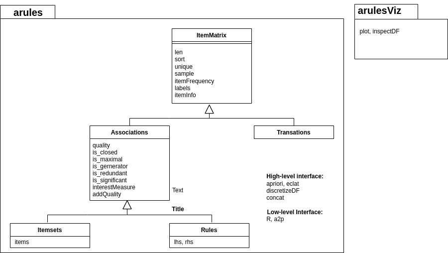
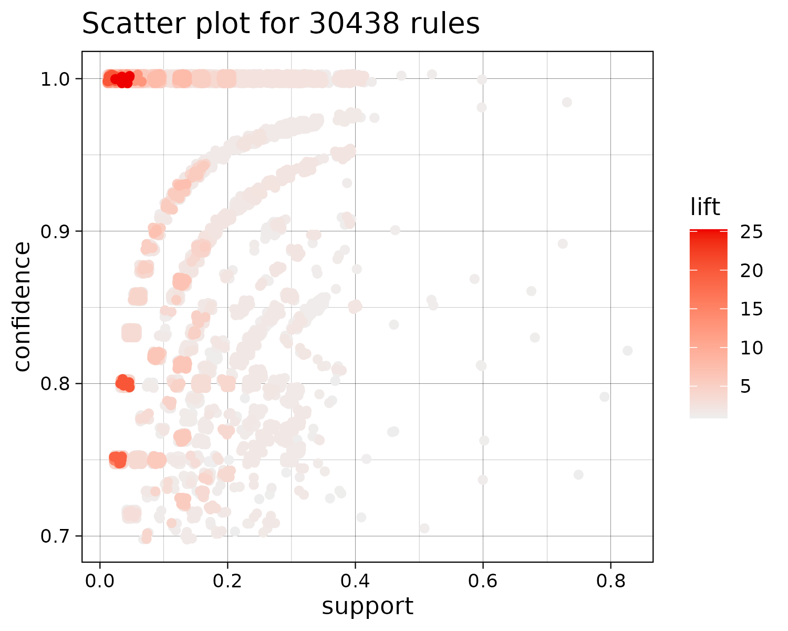
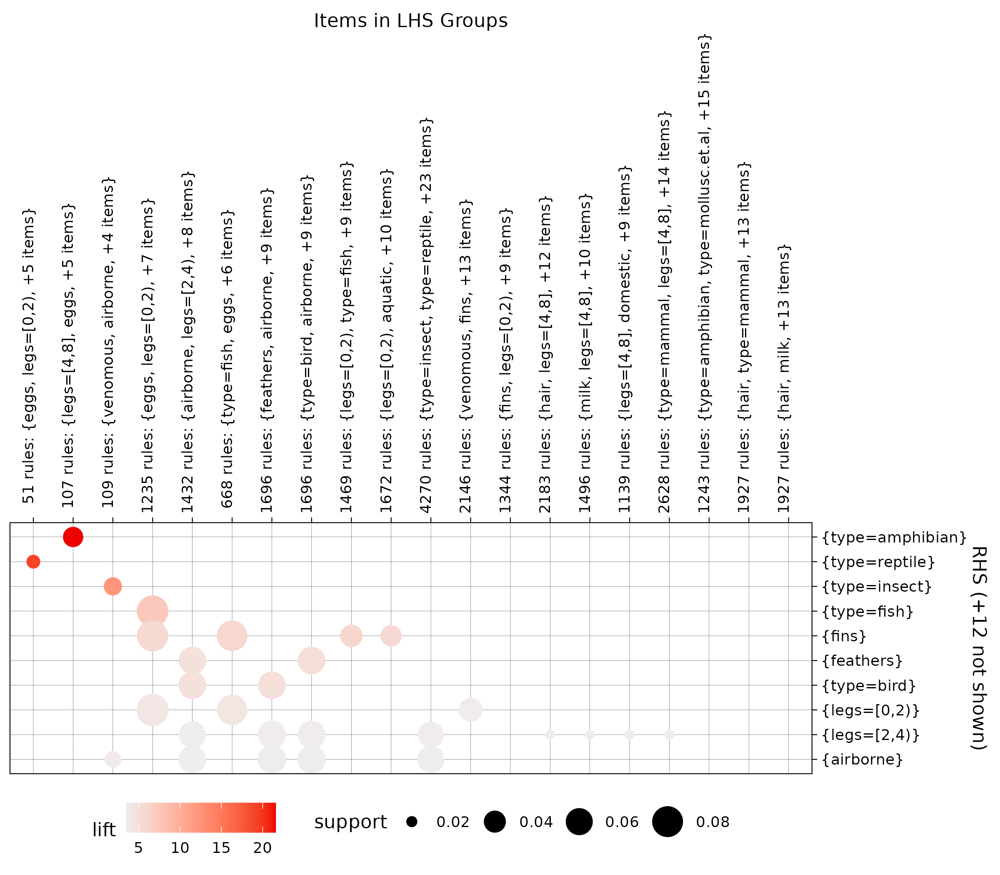
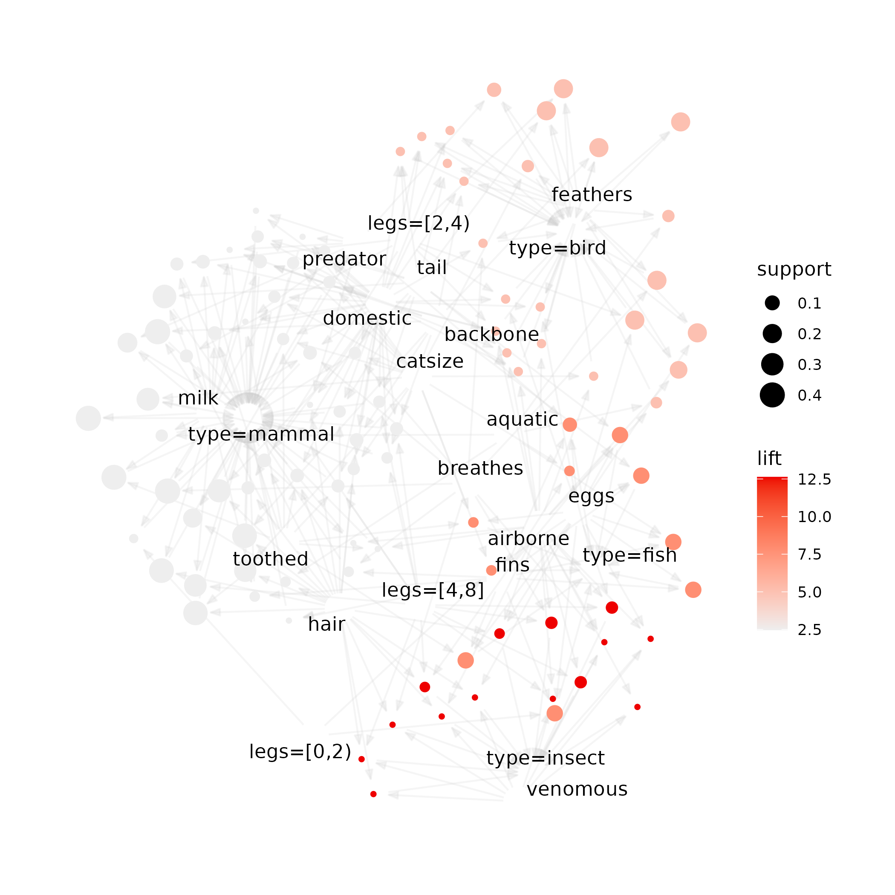

```{r, echo=FALSE}
options(tinytex.clean=FALSE)
```

# Statement of Need

Association rule mining plays a vital role in discovering hidden patterns and relationships within large transactional datasets. Applications range from exploratory data analysis in marketing to building rule-based classifiers. 
R [@arules:R:2005] users
have had access to the family of `arules` infrastructure packages for association rule mining
[@arules:Hahsler:2011] for a long time. The
core packages are `arules` [@arules:Hahsler+Gruen+Hornik:2005b] which provides the 
infrastructure for representing, manipulating and analyzing transaction 
data and frequent patterns (itemsets and association rules), and `arulesViz` 
[@arules:Hahsler:2017], providing 
various visualization techniques for association rules and itemsets. The packages are built on 
contributed C code, like the implementaiton of the APRIORI algorithm and the ECLAT algorithm provided by
Christian Borgelt [@arules:Borgelt:2003], C++ sparse matrix code provided by the R `Matrix` package
[@arules:Bates:2022], and
custom C/C++ code implemented by the `arules` team, and R interface code.
For portability, all C and C++ code has been updated to the latest standard (C++20 and C17).
The Python interface is based on `rpy2` [@arules:Charles:2022]. Much care has been 
taken to translate R's functional interface into a Pythonic package providing 
Python programmers with expected behavior.

With many data scientists needing to work with R, R markdown, but also with Python
and Jupyter notebooks, `arulespy` provides
a native and easy to install Python interface to the wide range of 
functionalists provided by the R packages `arules` and `arulesViz`. 

Several popular Python packages provide frequent pattern mining in Python
including in the popular `mlxtend` package [@raschkas_2018_mlxtend], but
`arules` still provides a higher level of functionality
in terms of visualization options, 
and available infrastructure. 

# Package Installation

`arulespy` is based on the Python package `rpy2`, which requires an R installation.
`arulespy` is easily installed from the Python Package Index using pip:

```{sh, eval = FALSE}
pip install arulespy
```

This installation will take care of installing the needed R packages. Note that the
R packages are installed during the first time arulespy is imported. This installation 
may require some time. Detailed installation instructions can be found
on the package's PyPI page [@arules:Hahsler:2023].

# Overview of features

## Pythonic high-level interface

`arulespy` provides the computational infrastructure to represent all data structures necessary
to mine association rules.
@arules:Agrawal+Imielinski+Swami:1993 introduced the problem 
of mining association rules from transaction data as follows (the definition is taken from @arules:Hahsler+Gruen+Hornik:2005b):

Let $I = \{i_1,i_2,...,i_n\}$ be a set of $n$ binary attributes called items. Let $D = \{t_1,t_2,...,t_m\}$ be
a set of transactions called the database. Each transaction in $D$ has a unique transaction ID and
contains a subset of the items in $I$. A rule is defined as an implication of the form $X \Rightarrow Y$ where
$X,Y \subseteq I$ and $X \cup Y = \emptyset$ are called itemsets. On itemsets and rules several quality measures can
be defined. The most important measures are support and confidence. The support $supp(X)$ of
an itemset $X$ is defined as the proportion of transactions in the data set which contain the itemset.
Itemsets with a support which surpasses a user-defined threshold $\sigma$ are called frequent itemsets. The
confidence of a rule is defined as $conf(X \Rightarrow Y) = supp(X \cup Y)/supp(X)$. Association rules are rules
with $supp(X \cup Y) \ge \sigma$ and $conf(X) \ge \delta$ where $\sigma$ and $\delta$ are user-defined thresholds.
More measures to judge the quality or interestingness of rules and itemsets have been described in 
the literature (see @arules:Tan:2004, @arules:Geng:2006, @arules:Lenca:2007). 
A complete list of available interest measures in `arulespy` can be found in @arules:Hahsler:2005. 

`arulespy` provides a high-level interface to transactions, itemsets, and rules based on 
sparse matrices representing sets of itemsets as with the class `itemMatrix`. 
<!-- Figure \@ref(fig:classes) shows the implemented classes divided by module. -->
Figure 1 shows the implemented classes divided by module.

```{r classes, echo=FALSE, out.width="90%", fig.cap="arulespy modules with Python classes.", fig.align = 'center'}

```

All classes provide Pythonic slicing using `[]`, ranges, `len()`,
methods for `sort()`, `unique()`, `sample()`, and methods to convert the 
data into different Python data structures are provided.
These include: `as_df()` (a pandas dataframe), `as_matrix()` (a numpy matrix), 
`as_dict()` (a Python dictionary), and `as_list()`.
Associations in addition provide methods to extract `quality()` information,
`items()` (`lhs()` and `rhs()` for rules),
and to determine if the association `is_closed()`, `is_maximal()`, `is_generator()`,
`is_redundant()`, or `is_significant()`.

Combining objects is modeled after `pandas.concat()` 
taking a list of objects to combine. 

For visualization, module `arulesViz` contains a `plot()` function to produce 
visualizations via `ggplot` and interactive HTML widgets to inspect rules 
(`inspectDF()`). 

The package uses docstrings and Python help can be obtained using `help()`.

## Creating transaction data

To prepare transaction data, arulespy provides `discretizeDF()` to prepare a pandas 
dataframe with numeric attributes by discretization and `Transactions.from_df()`
to convert pandas dataframes into sparse transaction representation.

```{python, eval = FALSE}
from arulespy.arules import Transactions, apriori, parameters
```

The data need to be prepared as a pandas dataframe. Here we import the 
Zoo dataset [@arules:Blake+Merz:1998] which contains the features of
101 animales as binary attributes, a numeric attribute for the number of legs and 
nominal animal type. We show some of the attributes for the first three animals.

```python
import pandas as pd

df = pd.read_csv('https://mhahsler.github.io/arulespy/examples/Zoo.csv')
df[0:3]
```

|     | hair   | feathers   | eggs   | ...   |   legs | tail   | domestic   | catsize   | type          |
|----:|:-------|:-----------|:-------| :---: |-------:|:-------|:-----------|:----------|:--------------|
|   0 | True   | False      | False  | ...   |      4 | False  | False      | True      | mammal        |
|   1 | True   | False      | False  |  ...  |      4 | True   | False      | True      | mammal        |
|   2 | False  | False      | True   |  ...  |      0 | True   | False      | False     | fish          |


Next, we convert the animals to transactions. In this process, binary attributes are 
converted into items, numeric attributes are discretized into range items and nominal attributes
are  automatically one-hot-encoded.

```python
trans = Transactions.from_df()
print(trans)
```

```
##    transactions in sparse format with
##     101 transactions (rows) and
##     25 items (columns)
```

```python
trans.as_df()
```

|     | items                                                                             |   transactionID |
|----:|:----------------------------------------------------------------------------------|----------------:|
|   1 | {hair,milk,predator,toothed,...,legs=[4,8],catsize,type=mammal}                   |               0 |
|   2 | {hair,milk,toothed,...,legs=[4,8],tail,catsize,type=mammal}                       |               1 |
|   3 | {eggs,aquatic,predator,...,fins,legs=[0,2),tail,type=fish}                        |               2 |
|...|...|...|

For space reasons, we only show the first three transactions and omit some of the items. Transactions are 
stored as a sparse matrix. The item definitions show that the number of legs was discretized 
into 3 ranges and the animal type was converted into 7 binary items.

```python
trans.itemInfo()
```

|    | labels             | variables   | levels        |
|---:|:-------------------|:------------|:--------------|
|  1 | hair               | hair        | TRUE          |
|  2 | feathers           | feathers    | TRUE          |
|  3 | eggs               | eggs        | TRUE          |
|  4 | milk               | milk        | TRUE          |
|  5 | airborne           | airborne    | TRUE          |
|  6 | aquatic            | aquatic     | TRUE          |
|  7 | predator           | predator    | TRUE          |
|  8 | toothed            | toothed     | TRUE          |
|  9 | backbone           | backbone    | TRUE          |
| 10 | breathes           | breathes    | TRUE          |
| 11 | venomous           | venomous    | TRUE          |
| 12 | fins               | fins        | TRUE          |
| 13 | legs=[0,2)         | legs        | [0,2)         |
| 14 | legs=[2,4)         | legs        | [2,4)         |
| 15 | legs=[4,8]         | legs        | [4,8]         |
| 16 | tail               | tail        | TRUE          |
| 17 | domestic           | domestic    | TRUE          |
| 18 | catsize            | catsize     | TRUE          |
| 19 | type=amphibian     | type        | amphibian     |
| 20 | type=bird          | type        | bird          |
| 21 | type=fish          | type        | fish          |
| 22 | type=insect        | type        | insect        |
| 23 | type=mammal        | type        | mammal        |
| 24 | type=mollusc.et.al | type        | mollusc.et.al |
| 25 | type=reptile       | type        | reptile       |

We can easily slice transactions, sample form transactions, combine them and find unique transactions
using methods for the Python Transactions class.

## Mining Association Rules

The mining functions `apriori()` and `eclat()` are part of the high-level interface.
`apriori()` calls the APRIORI algorithm implemented in the R package arules and
performs all necessary conversions. Parameters for the algorithm
are specified as a Python `dict` inside the `parameter()` function.

```python
rules = apriori(trans,
                    parameter = parameters({"supp": 0.01, "conf": 0.7}), 
                    control = parameters({"verbose": False}))  

print(rules)
```

```
##  set of 30438 rules
```

We can inspect the top three confidence rules.
```{python, eval = FALSE}
rules.sort(by = 'confidence')[0:3].as_df()
```

|    | LHS              | RHS          |   support |   confidence |   coverage |   lift |   count |
|---:|:-----------------|:-------------|-------:|----------:|--------:|-----:|-----:|
|  4 | {type=amphibian} | {aquatic}    |      0.04 |            1 |       0.04 |   2.81 |       4 |
|  5 | {type=amphibian} | {legs=[4,8]} |      0.04 |            1 |       0.04 |   1.98 |       4 |
|  6 | {type=amphibian} | {eggs}       |      0.04 |            1 |       0.04 |   1.71 |       4 |

The set of rules is rather large with a length of
```python
len(rules)
```

```
##  30438
```


Rules can be tested for many properties. For example, a rule
is improvement-based redundant if a more general rule with the same
or a higher confidence exists in the set [@arules:Bayardo+Agrawal+Gunopulos:2000]. 
The following code filters all redundant rules using Python list comprehension reducing the 
set to about a third.

```python
non_redundant_rules = rules[[not x for x in rules.is_redundant()]]
non_redundant_rules.as_df()
```
|       | LHS                                    | RHS              |   support |   confidence |   coverage |   lift |   count |
|------:|:---------------------------------------|:-----------------|----------:|-------------:|-----------:|-------:|--------:|
|     1 | {}                                     | {tail}           |      0.74 |         0.74 |       1    |   1    |      75 |
|     2 | {}                                     | {breathes}       |      0.79 |         0.79 |       1    |   1    |      80 |
|     3 | {}                                     | {backbone}       |      0.82 |         0.82 |       1    |   1    |                           | {legs=[4,8]}     |      0.04 |         1    |       0.04 |   1.98 |     
| ...| ...| ...|...|...|...| 
| 11676 | {predator,toothed,  breathes,tail}       | {catsize}        |      0.15 |         0.71 |       0.21 |   1.64 |      15 |
| 11691 | {eggs,toothed,  breathes,tail}           | {predator}       |      0.04 |         1    |       0.04 |   1.8  |       4 |

## Visualization

The set of rules is still relatively large, but visualization can help analyzing the
rules. The `arulespy` module `arulesViz`
can produce a wide range of visualizations for association rules
[@arules:Hofmann+Wilhelm:2001]. It exports a plot function which produces 
`ggplot2` plots [@arules:Wickham:2016]. 

```python
from arulespy.arulesViz import plot, inspectDF
from rpy2.ipython.ggplot import image_png
```

The standard plot is a scatter plot of rules using support and consequence
on the axes and lift for color shading. `ggplot` objects can
be rendered directly in a Jupyter notebook code cell using `image_png()`.

```python
gg = arulesViz.plot(rules, method="scatter")
image_png(gg)
```
<!-- In Figure \@ref(fig:scatter), -->
In Figure 2,
we see that high lift rules have typically relative low support and
the process of association rule generation from frequent itemsets 
results in characteristic streaks of rules in the support/confidence space
with similar items in the LHS and RHS.

Plots can also be saved as an image using `ggsave()` (from the R package `ggplot2`).
```python
ggsave = packages.importr('ggplot2').ggsave
ggsave(gg, file = "scatterplot.png")
```

```{r scatter, echo=FALSE, out.width="60%", fig.cap="Scatter plot of the rules", fig.align = 'center'}

```

Another visualization that is appropriate for large rule sets is a
matrix visualization grouped by LHS itemsets
introduced by @arules:Hahsler2016c.
<!-- Figure \@ref(fig:grouped) shows a that the highest-lift rule groups in the top-lift relate -->
Figure 3 shows a that the highest-lift rule groups in the top-lift relate
eggs and a different number of legs with the animal types amphibian and reptile. Lift
quickly decreases as we move down, while support generally increases.  

```python
gg = plot(rules, method="grouped")
image_png(gg)
```

```{r grouped, echo=FALSE, out.width="80%", fig.cap="Grouped matrix visualization", fig.align = 'center'}

```

Another popular visualization of a set of rules is as a graph.
This visualization method is only useful for relatively small rules sets.
We therefore filter the rules first to keep only rules with an
animal-type item in the RHS. This can be again done by list comprehension
and slicing.

```python
type_rules = rules[['type' in x for x in rules.rhs().labels()]]
```

We plot now the top 100 rules by confidence as a graph. 
Rules are represented as bubbles with the size proportional to rule
support and the color proportional to lift.
<!-- In Figure \@ref(fig:graph), -->
In Figure 4,
we can identify
four groups of rules with the items for the types bird, mammal, fish and 
insect in the RHS. While mammal rules are generally high-support and low-lift, 
insects rules have very high lift. 

```python
rules_top_100 = arules.sort(type_rules, by = 'confidence')[0:100]
gg = arulesViz.plot(rules_top_100, method="graph")
```

```{r graph, echo=FALSE, out.width="70%", fig.cap="Plot rules as a graph", fig.align = 'center'}

```

## Interactive Visualizations

`arulesViz` supports interactive visualizations [@arules:Hahsler:2017]
using interactive HTML widgets [@arules:Vaidyanathan:2023], which are
self-contained HTML pages that can be shared as HTML or embedded directly into
Jupyter notebooks using an `IFrame`.

A very powerful tool to analyze sets of rules is just a sortable table.
`inspectDF()` produces a widget where rules can be interactively filtered 
and sorted. Most static plots available in module `arulesViz`
can also be created as interactive widgets using packages like
`plotly` [@arules:Sievert:2020] and `visNetwork` [@arules:Almende:2022]. 
The interactive widget created by the following code is
available at https://mhahsler.github.io/arulespy/examples/rules.html.

```python
from IPython.display import IFrame
import rpy2.robjects.packages as packages
saveWidget = packages.importr('htmlwidgets').saveWidget

m = inspectDT(rules)

saveWidget(m, "datatable.html", selfcontained = True)
IFrame("datatable.html", "100%", 800)
```

# Low-level Interface

The `arules` module of `arulepy` exports the rpy2 interface to
the `arules` library using the symbol `R`. This provides a complete 
low-level interface to all arules functions (see arules reference manual at https://mhahsler.r-universe.dev/arules#reference). 
Note that the low-level interface expects all parameters to be R/rpy2 data type 
and also returns them. Automatic conversion is not provided, but the helper function 
`a2py()` can be used as a convenient way to convert R data types into Python data types.

In the following, we create a set of 1000 random transactions and convert the 
R/rpy2 transactions object to a Python object.

```python
from arulespy.arules import R, r2py

trans = a2py(R.random_transactions(10, 1000))
print(trans)
```

```
## transactions in sparse format with
##  1000 transactions (rows) and
##  10 items (columns)
```

The low-level interface also lets the user directly access the sparse representation.
It is automatically transformed into a `scipy` sparse array.

```python
from scipy.sparse import csc_array

trans.items().as_csc_array()
```

```
## <10x1000 sparse array of type '<class 'numpy.int64'>'
##  	with 2959 stored elements in Compressed Sparse Column format>
```

Finally, the low-level interface also lets the user manually define the contents
of objects in arules. For example, we create a set of three rules. This is a 
low-level operation, since it translates item labels in Python lists into 
the sparse representation used internally.

```python
lhs = [
    ['hair', 'milk', 'predator'],
    ['hair', 'tail', 'predator'],
    ['fins']
]

rhs = [
    ['type=mammal'],
    ['type=mammal'],
    ['type=fish']
]
                          
r = Rules.new(ItemMatrix.from_list(lhs, itemLabels = trans),
              ItemMatrix.from_list(rhs, itemLabels = trans))

r.addQuality(r.interestMeasure(['support', 'confidence', 'lift'], trans))

r.as_df()
```

|    | LHS                  | RHS           |   support |   confidence |   lift |
|---:|:---------------------|:--------------|----------:|-------------:|-------:|
|  1 | {hair,milk,predator} | {type=mammal} |      0.2  |         1    |   2.46 |
|  2 | {hair,predator,tail} | {type=mammal} |      0.16 |         1    |   2.46 |
|  3 | {fins}               | {type=fish}   |      0.13 |         0.76 |   5.94 |

Most functions in arules are accessible using the Python classes and their methods.
Using the low-level interface will only needed occasionally or when the user wants to
implement new functionality that performs computation on the underlying data.


# Conclusion

This report introduces the usage of `arulespy`, a new package that makes the functionality
of the R infrastructure to mine and visualize association rules available to the Python community.
After R is installed, no further R knowledge is necessary to work with the package and 
most functions work as expected by Python programmers and integrate easily with
popular Python tools like Jupyter notebooks.

# References
